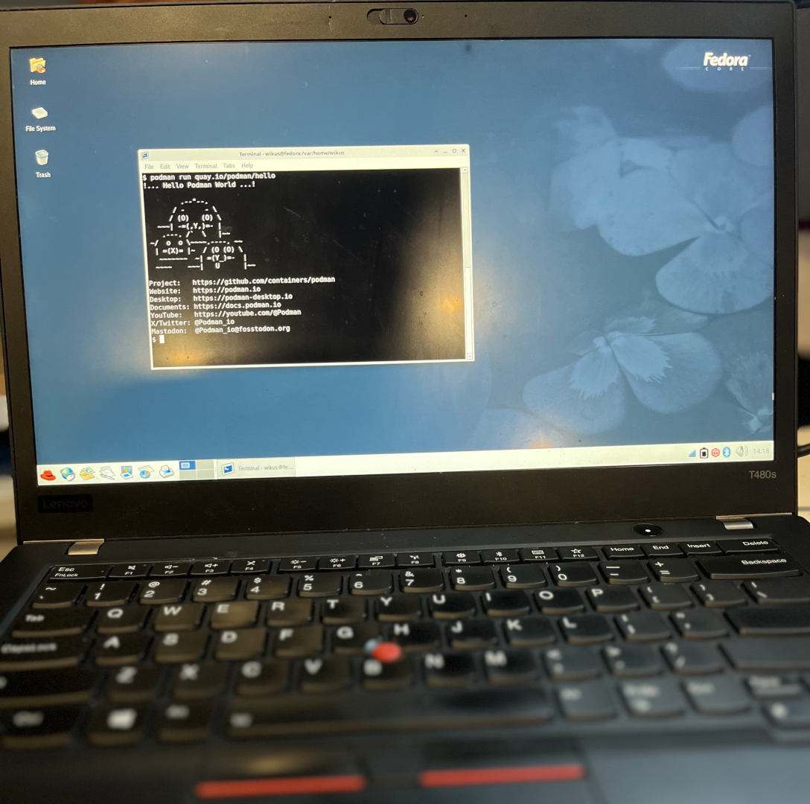

# Blueboots: Retro Looks, Atomic Upgrades

> A Fedora BootC OS themed like it's 2003, but updated like it's 2025.

[](https://quay.io/repository/blueboots/os)


<table>
    <tr>
        <td></td>
        <td></td>
    </tr>
</table>

A graphical declarative OS with a retro theme ([Bluecurve](https://github.com/neeeeow/Bluecurve)) reminiscent of [Fedora Core 1.0](https://en.wikipedia.org/wiki/Fedora_Linux#History).

Using [bootc](https://bootc-dev.github.io/bootc/) for transactional upgrades!

All built within one `Containerfile`![1]

This main OS image is hosted on [Quay.io](https://quay.io) at:

```sh
podman pull quay.io/blueboots/os
```

[1]Technically the `/theme` folder is passed in. Otherwise, everything is in a single `Containerfile`!

## Topics

- [Technology](#technology)
- [Important Notes](#important-notes)
- [Requirements](#requirements)
- [Usage](#usage)
- [Advanced Usage](#advanced-usage)
- [Known Issues](#known-issues)

## Technology

This **Bootable Container (bootc)** OS uses [bootc-image-builder](https://github.com/osbuild/bootc-image-builder) in order to build bootable _container_ disk images.

You will be using this in order to **add users** for you to login!

Once a machine is created from the disk image, it can apply transactional updates "in place" from newly pushed container images (without creating a new disk image). For more information, see [bootc](https://bootc-dev.github.io/bootc/). That means it's as easy as `bootc upgrade` after pushing your image with `podman push`.

### Learning more about bootc

If you want to learn more about bootable containers, please refer to the [Fedora Getting Started Guide](https://docs.fedoraproject.org/en-US/bootc/getting-started/) where you can find a number of videos, demos, best practices and detailed information.

## IMPORTANT NOTES

- To install additional software, use [Flatpak](https://flatpak.org/).
- Want to install a package to the CORE of the OS? See our [advanced usage guide](#advanced-usage).
- ONLY uses generic GPU drivers (Intel integrated GPU, AMD integrated GPU, etc.) from `@hardware-support` in RHEL-derivative OS'
- No NVIDIA GPU support yet (upcoming)
- No AMD GPU support yet (upcoming)

## Requirements

### Prerequisites: Software and hardware requirements

We have to initially build our OS! So look below for requirements.

**OS:**

Compatible on Windows, macOS & Linux.

**Software:**

- [Podman Desktop](https://github.com/containers/podman-desktop)
- [BootC Extension for Podman Desktop](https://github.com/podman-desktop/extension-bootc)

## Usage

1. **Pull the container image:**

> Pull the container via CLI or within Podman Desktop

```sh
podman pull quay.io/blueboots/os
```


1. **(alternatively) Build your bootc-enabled Containerfile:**

> Git clone this project and build your image locally.

```sh
git clone http://github.com/cdrage/blueboots
podman build -t quay.io/foo/bar .
```

2. **Build the disk image:**

> Build the disk image with the Podman Desktop BootC extension. Make sure you provide your username and password.

**Important note:** Use the *interactive installer* within the BootC extension to add your username and password! Or else you will **NOT BE ABLE TO LOGIN**.

1. Choose either `.iso` for an *unattended ISO installer* which will **AUTOMATICALLY WIPE THE FIRST AVAILABLE DISK**. Use with caution! Or `.raw` or any other applicable image type to test locally, such as a live USB stick for testing.
2. Add your username and password for logging in as well as your "group" (wheel for passwordless sudo access):


3. **Installation:**

**If you chose ISO:**

1. "Write" the ISO using [balenaEtcher](https://etcher.balena.io/) or [Fedora Media Writer](https://en.wikipedia.org/wiki/Fedora_Media_Writer) to a USB stick
2. Plug into a PC and select the USB from the boot screen
3. Watch as it installs unattended to the first available drive.

**If you chose RAW:**
1. You can "write" the `.raw` image with the above tools with either [balenaEtcher](https://etcher.balena.io/) or [Fedora Media Writer](https://en.wikipedia.org/wiki/Fedora_Media_Writer) to a USB stick.
2. Plug into a PC and select the USB from the boot screen
3. Test out the "live" image.

## Advanced usage

### Making changes to your OS

Want to change a "core" package or make system changes that propagate to your OS? Follow below!

In this example we will **add a basic package** called [`figlet`](http://www.figlet.org/):


1. Edit your `Containerfile`:

Within the [Containerfile](/Containerfile) add the following to the list of packages:

```Dockerfile
RUN dnf install -y \
  # ...
  figlet
  dnf clean all && \
  rm -rf /var/cache/dnf
```

2. Build & push your container:

```sh
podman build -t quay.io/foo/bar .
```

3. Run `bootc upgrade` on your OS:

The command will download your hosted package and then apply all transactional updates.

```sh
bootc upgrade
```

4. Reboot and check that `figlet` is installed!

```sh
$ figlet "Hi"
 _   _ _ 
| | | (_)
| |_| | |
|  _  | |
|_| |_|_|
```

### Using the `bootc` CLI tool

The `bootc` CLI command is the "bread-and-butter" of all bootc-derived images.

Once booted into the system, you can manage it using the `bootc` CLI:

- **Status:** `bootc status` shows the current image and version.
- **Upgrade:** `bootc upgrade` pulls the latest OCI image to apply next reboot.
- **Fetch:** `bootc fetch` pre-downloads an update without applying it.
- **Install:** `bootc install --target /dev/sdX` writes the OS to a block device, good for when "live booting" on a USB flash drive for testing.

See [bootc-dev.github.io/bootc](https://bootc-dev.github.io/bootc) for more information.

## Known issues

No GPU support for NVIDIA and AMD (yet).